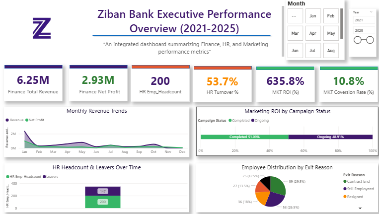
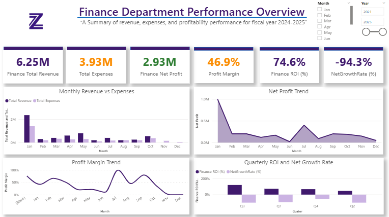
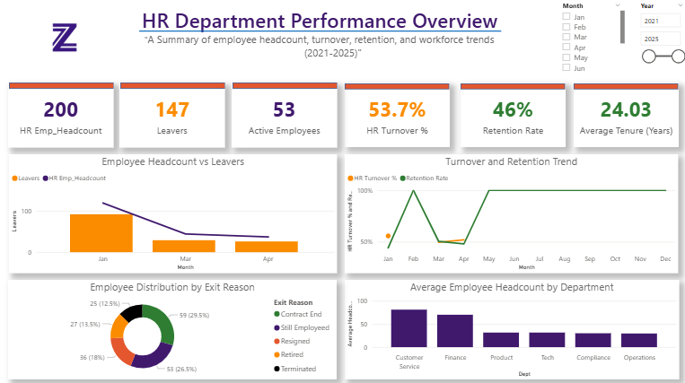

# Ziban Bank Performance Analysis

This repository contains a full Power BI analysis of Ziban Bank’s Finance, HR, and Marketing performance from 2021 to 2025. All sensitive identifiers were removed, and the organizational branding was modified to preserve confidentiality.

---

## Table of Contents
- [Introduction](#introduction)
- [Dataset Overview](#dataset-overview)
- [Data Cleaning Process](#data-cleaning-process)
- [Methodology](#methodology)
- [KPIs and Metrics](#kpis-and-metrics)
- [Findings and Insights](#findings-and-insights)
- [Dashboard Snapshots](#dashboard-snapshots)
- [Conclusion](#conclusion)
- [Recommendations](#recommendations)
- [Interactive Dashboard](#interactive-dashboard)

---

## Introduction

This report provides a detailed business performance analysis of Ziban Bank between 2021 and 2025. The goal of the project is to evaluate performance across Finance, Human Resources, and Marketing using data modeling, DAX calculations, and Power BI dashboards.  
The insights support informed decision-making, long-term planning, and overall performance monitoring.

---

## Dataset Overview

The dataset used for this analysis includes:  
- HR employee records (hire dates, exit dates, tenure, job roles)  
- Financial data (revenue, expenses, profit)  
- Marketing data (campaign performance, conversion rates, ROI)  

The dataset spans from 2021 to 2025 and was cleaned to remove sensitive personal identifiers. All branding was changed from the original institution to Ziban Bank to maintain confidentiality.

---

## Data Cleaning Process

Data transformation and cleaning were done in Power Query. Steps included:
- Removing duplicate entries  
- Standardizing column names  
- Correcting inconsistent date formats  
- Replacing null join/exit dates with placeholder dates  
- Ensuring numerical fields were properly typed  
- Validating financial and HR metrics for accuracy  

---

## Methodology

### 1. Data Source  
Internal HR, Finance, and Marketing datasets covering 2021–2025.

### 2. Data Cleaning  
Performed using Power Query:
- Removed duplicates  
- Standardized formats  
- Replaced blank dates  
- Renamed columns for clarity  

### 3. Data Transformation  
Generated additional calculated fields:
- Year  
- Month  
- Tenure  
- Exit Status  

### 4. Data Modeling  
- Built a star schema with a central Date Table  
- Linked Finance, HR, and Marketing tables via One-to-Many relationships  
- Ensured proper model performance for DAX measures  

### 5. DAX Calculations  
Created measures for:
- Headcount  
- Attrition  
- Revenue  
- Profit and Profit Margin  
- ROI  
- Conversion Rate  

### 6. Dashboard Design  
Four dashboards were created:
- Executive Overview  
- Finance Dashboard  
- HR Dashboard  
- Marketing Dashboard  

---

## KPIs and Metrics

### Finance  
- Total Revenue  
- Total Expenses  
- Net Profit  
- Profit Margin  
- Net Profit Growth Rate  

### HR  
- Employee Headcount  
- New Hires  
- Exits  
- Attrition Rate  
- Average Tenure  

### Marketing  
- ROI  
- Conversion Rate  
- Campaign Performance  

---

## Findings and Insights

- Revenue and profit increased consistently across the five-year period.  
- HR records show improved workforce stability and reduced turnover.  
- Marketing ROI peaked in 2024 before declining in 2025.  
- Campaign efficiency improved with better targeting in later years.  

---

## Dashboard Snapshots

### Executive Overview  

### Finance Dashboard  

### HR Dashboard  

### Marketing Dashboard  

---

## Conclusion

Ziban Bank demonstrated strong financial growth from 2021 to 2025, supported by increasing headcount and improving marketing performance. Although results show solid performance overall, turnover management and campaign consistency remain areas for continued improvement.

---

## Recommendations

### Finance  
- Review operational expenses regularly.  
- Implement quarterly forecasting for better financial planning.

### Human Resources  
- Strengthen retention strategies.  
- Track exit reasons to identify emerging patterns.

### Marketing  
- Focus on campaigns with the highest ROI.  
- Improve conversion rates using targeted segmentation and analytics.

---

## Interactive Dashboard

You can view the live interactive dashboard using the link below:

*Published Power BI Dashboard:*  
[Click to View Dashboard](https://app.powerbi.com/view?r=eyJrIjoiMjkyNDlkNmMtMWU5Zi00M2RiLWJhYzUtYWQ0M2E2MGE5MWY4IiwidCI6ImMyYjE1OGJkLTZkMTItNDQzZC1iYTUwLTM1NTUzYjE4N2UyNSJ9)

## Respository File Structure
ziban-bank-performance-analysis/
│
├── README.md
│

├── images/
│   ├── ZB_Executive.png
│   ├── ZB_Finance.png
│   ├── ZB_HR.png
│   └── ZB_MKT.png
│

├── pbix/
│   └── Ziban_Bank_Capstone_Project.pbix   
│

└── docs/
    └── Ziban_Bank_Performance_Report.pdf   

---
